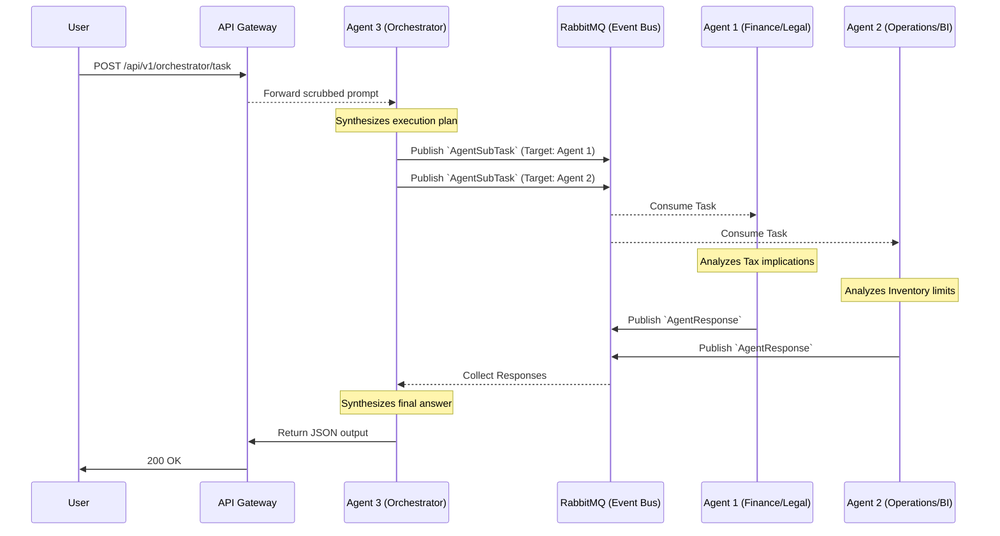

# Agent Orchestration & Communication

In a Multi-Agent system, the hardest challenge is not writing the AI logic, but managing how the AI agents talk to each other without timing out or entering infinite loops.

The MIR-Ecosystem solves this by completely decoupling the agents using an asynchronous Event Bus powered by **RabbitMQ**.

## The Meta Orchestrator (Agent 3)

Instead of a user talking directly to specialized agents, all complex requests hit the **Meta Orchestrator (Agent 3)** first.
The Orchestrator's job is to:
1. Parse the user's natural language request.
2. Break it down into sub-tasks.
3. Publish those sub-tasks to the Event Bus.
4. Wait for the specialized agents to finish, then synthesize a final response.

## Asynchronous Flow (Mermaid Diagram)

The following diagram illustrates how a single user request flows through the ecosystem.

## Data Contracts (Pydantic Schemas)

Agents do not send raw text to each other. They communicate using strict Python Pydantic models defined in `ai_layer/core/events.py`. This ensures that if Agent 1 sends a message, Agent 2 knows exactly how to parse it.

- `TaskRequested`: A raw request coming from the API Gateway.
- `AgentSubTask`: A specific command issued by the Orchestrator to a worker agent.
- `AgentResponse`: The JSON output of a worker agent's hard work, sent back to the Orchestrator.
- `WorkflowCompleted`: The final, synthesized output.

By using RabbitMQ, if Agent 1 crashes while calculating taxes, the message stays in the queue until the agent reboots and can try again. This guarantees **fault tolerance**.
