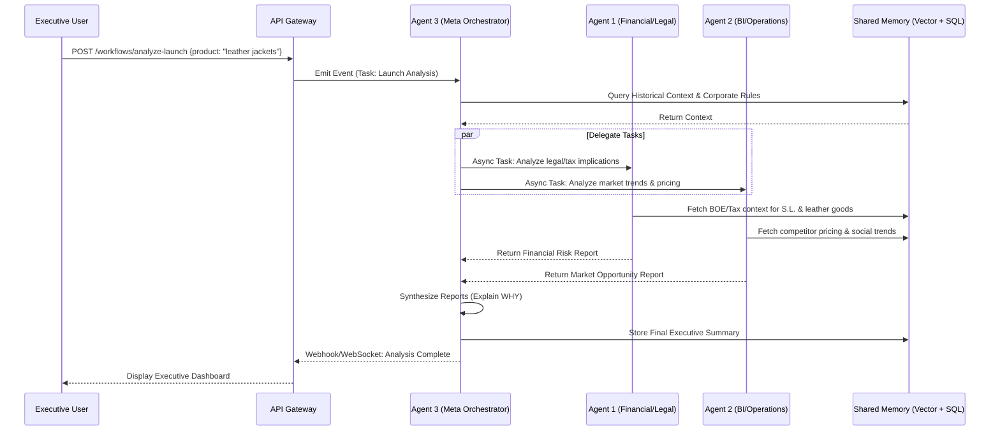
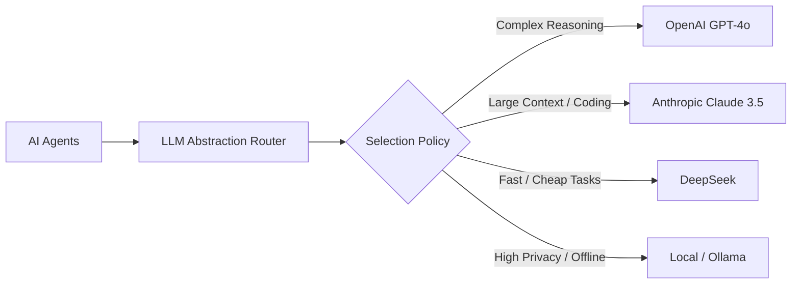

# 4. Agent Orchestration & Multi-Agent Framework

## 4.1 Orchestration Architecture
The core cognitive engine of the MIR-Ecosystem relies on an asynchronous, event-driven multi-agent framework. Agents do not act as simple chat endpoints; they operate as autonomous background workers that consume tasks, retrieve context from memory, reason, and output structured reports or triggers.

### The Meta Orchestrator (Agent 3: Governor)
Agent 3 acts as the router, supervisor, and quality controller for the entire system.
- **Routing**: Receives high-level tasks and delegates them to specialized agents (e.g., Financial, BI).
- **Synthesis**: Merges outputs from multiple agents into coherent executive reports.
- **Quality Control**: Monitors token usage, evaluates agent confidence, and requests revisions if an agent's output is hallucinated or incomplete.

## 4.2 Agent Interaction Flow

## 4.3 LLM Abstraction Layer
To prevent vendor lock-in, all agents interact with an LLM Router/Abstraction Layer. 

### Fallback System
If OpenAI rate limits are hit, the Router automatically falls back to Anthropic, then DeepSeek.

## 4.4 Agent Specialized Roles

### Agent 1: Financial & Legal Engine
- **Triggers**: Scheduled (monthly tax runs), Event-based (new BOE publication), On-demand (executive query).
- **Tools**: BOE Scraper API, Agencia Tributaria Form Generator, Stripe/Bank API integrations.
- **Safety**: Generates "Drafts" only. Requires human approval for irreversible actions like submitting taxes (Modelo 303).

### Agent 2: Operations & Business Intelligence
- **Triggers**: Scheduled (daily sales report), Event-based (inventory low), On-demand.
- **Tools**: Social Media Scrapers, Competitor Price Trackers, ERP integrations.
- **Output**: Prescriptive analytics (e.g., "Increase price by 5% due to competitor stockout").
