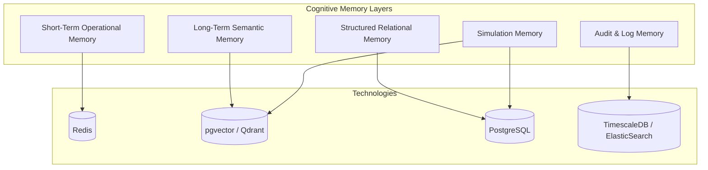

# 5. Memory & Data Architecture

## 5.1 The Cognitive Memory Framework
Unlike standard applications that use a simple database, the MIR-Ecosystem treats storage as **"Memory"** allowing the AI to recall context, learn from past decisions, and maintain state over long periods.

We separate memory into distinct functional layers.



## 5.2 Memory Layer Definitions

### 1. Short-Term Operational Memory (Redis)
- **Purpose**: Stores active workflows, current conversation context, intermediate agent reasoning, and task queues.
- **TTL**: Highly ephemeral. Context is either forgotten or summarized and moved to Long-Term Memory.

### 2. Long-Term Semantic Memory (Vector Database)
- **Purpose**: Embeddings-based storage for document retrieval (RAG).
- **Contents**: 
  - Legal documents (BOE, tax laws).
  - Past generated executive summaries.
  - Standard Operating Procedures (SOPs) of the holding company.
- **Partitioning**: Must strictly partition namespaces by Tenant ID and Agent ID to ensure data security.

### 3. Structured Relational Memory (PostgreSQL)
- **Purpose**: Absolute ground truth for business operations.
- **Contents**:
  - Financial records, invoices, bank transactions.
  - Users, Organizations, Roles, Subscriptions.
  - Inventory, Orders.

### 4. Audit Memory (Time-Series / Immutable Logs)
- **Purpose**: Compliance and "Explainability".
- **Contents**:
  - Exact prompts sent to the LLM and the exact responses.
  - Trace of which agent made which decision and why.
  - User actions and configuration changes.

### 5. Simulation Memory
- **Purpose**: Isolated data clones for the Simulation Engine.
- **Mechanism**: The system can clone a subset of Structured and Semantic memory into a sandboxed environment to allow Agent 1 and Agent 2 to run "what-if" scenarios (e.g., changing tax laws) without affecting production data.

## 5.3 Multi-Tenant Data Isolation Strategy
We will use a **Row-Level Security (RLS)** model in PostgreSQL, enforcing tenant isolation at the database level rather than relying purely on application logic.

```sql
-- Conceptual Example of RLS for Invoices
CREATE POLICY tenant_isolation_policy ON invoices
    USING (tenant_id = current_setting('app.current_tenant_id')::uuid);
```
Vector databases will similarly use payload filtering (e.g., `filter: { tenant_id: "xyz" }`) on every semantic query.
