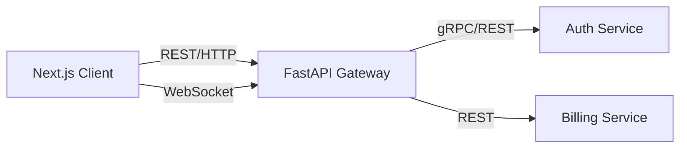
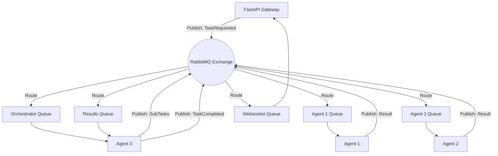

# 6. API & Event-Driven Architecture

## 6.1 API Architecture (Synchronous)
The synchronous API layer is built on **FastAPI (Python)** due to its native async support, automatic OpenAPI (Swagger) generation, and high performance.

### API Gateway / BFF (Backend for Frontend)
Instead of the frontend calling microservices directly, all traffic goes through the API Gateway. This ensures centralized authentication, rate limiting, and request validation.

- **Protocol**: HTTP/2 over TLS.
- **Format**: JSON (REST).
- **WebSockets**: Used for real-time agent updates (e.g., streaming the thought process of Agent 3 to the frontend dashboard).



## 6.2 Event-Driven Architecture (Asynchronous)
The MIR-Ecosystem relies heavily on asynchronous processing because AI tasks (like generating a financial report or scraping BOE) are inherently slow.

### Message Broker: RabbitMQ
RabbitMQ is used to decouple the API from the heavy lifting of the AI models. 

### Event Flow Example
1. **Producer**: User triggers an analysis via the API Gateway.
2. **Event**: Gateway publishes a `TaskRequested` event to the `OrchestratorQueue`.
3. **Consumer**: The Meta Orchestrator picks up the event and acknowledges it.
4. **Sub-tasks**: The Orchestrator publishes `FinancialAnalysisRequired` to the `Agent1Queue` and `TrendAnalysisRequired` to the `Agent2Queue`.
5. **Completion**: Agents publish their results to the `ResultsQueue`. The Orchestrator consumes these, synthesizes them, and publishes a `TaskCompleted` event.
6. **Notification**: The Notifications Service consumes `TaskCompleted` and pushes the result to the Frontend via WebSocket.



## 6.3 Standardized Event Schema
Every event passed through the broker must follow a strict schema to ensure compatibility and traceability:

```json
{
  "event_id": "uuid-v4",
  "trace_id": "uuid-v4-for-opentelemetry",
  "timestamp": "ISO-8601",
  "tenant_id": "uuid-v4",
  "event_type": "TaskRequested",
  "payload": {
     "task_type": "analyze_product_launch",
     "parameters": { ... }
  },
  "metadata": {
     "requested_by": "user-uuid"
  }
}
```
